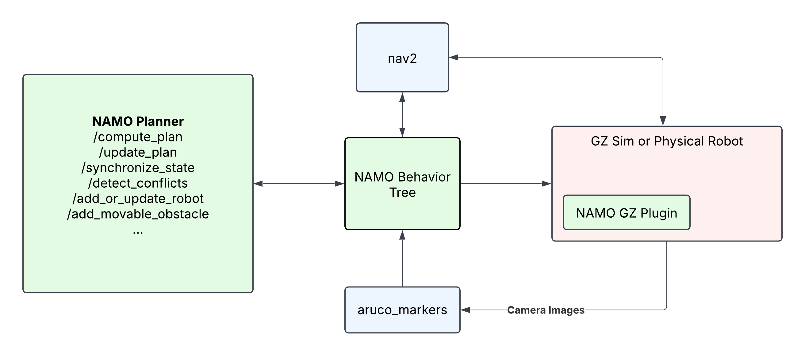
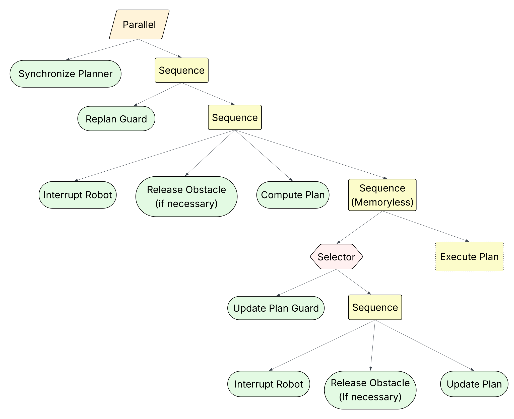
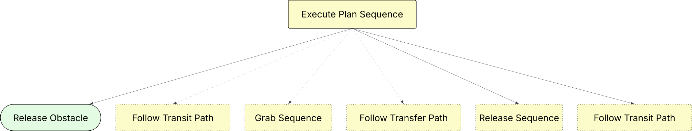
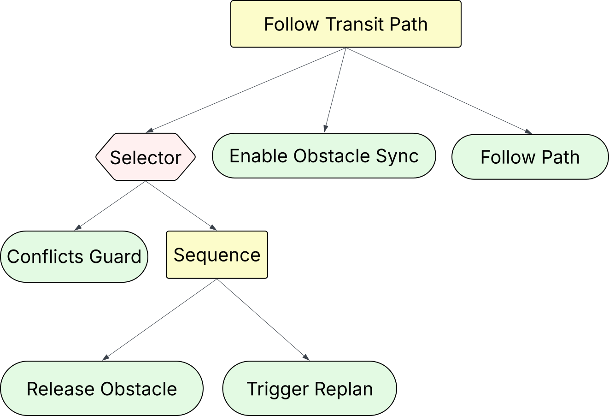
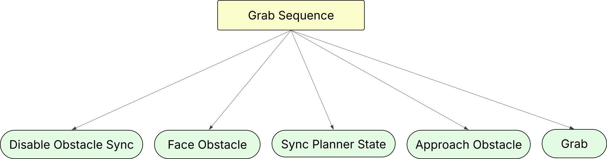
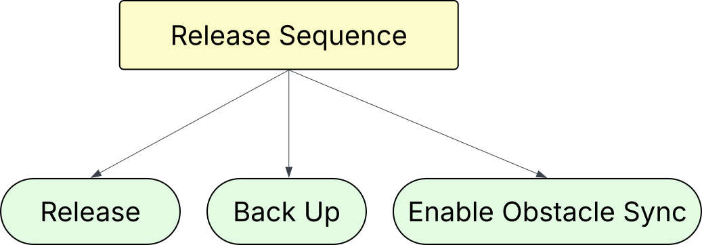
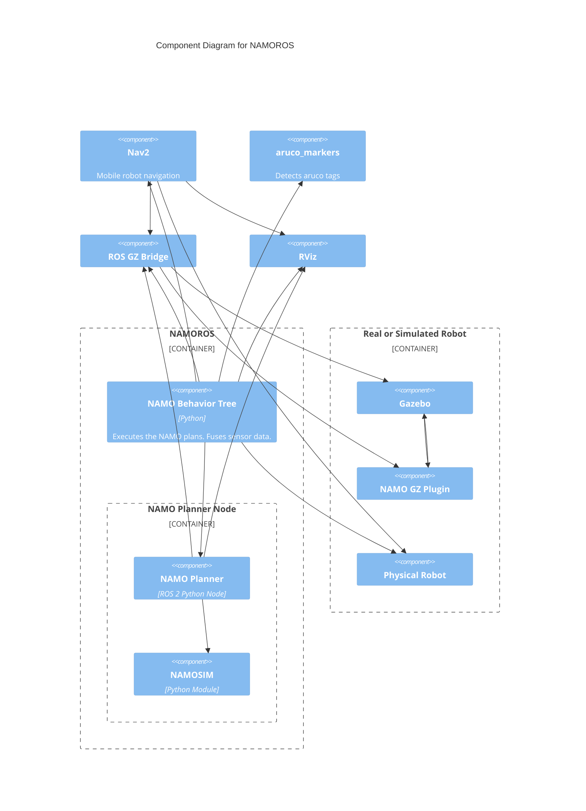

# NAMOROS

A set of ROS2 nodes which expose services and topics for computing NAMO plans and interacting with the **namosim** planner
This repo consists of the following ROS2 packages:

## System Requirements

- Ubuntu 22.04
- ROS2 Humble

## Setup

First, clone the repo and `cd` into it.

```bash
git clone --recurse-submodules git@gitlab.inria.fr:chroma/namo/namoros.git
cd namoros
```

Next, use `rosdep` to install the dependencies listed in the `package.xml` files:

```bash
rosdep install --from-paths . -r -y
```

If any of the python dependencies fail to install with `rosdep` you can try to install them with `pip` instead:

```bash
pip install -r namosim/requirements.txt
pip install -r namoros/requirements.txt
```

Finally, build and source the project.

```bash
colcon build
source install/setup.bash
```

## Demostrations

In order to launch a simulation demonstration a robot that makes use of namoros nodes, run the following script.

```bash
./launch_demo.sh
```

## Architecture

The system is organized as ROS2 packages:

- `namoros`: ROS2 nodes to control the robot and interacting with the namosim planner within a behavior tree framework
- `namosim`: The core planner for navigation and multi-robot coordination
- `namoros_msgs`: Custom ROS2 message definitions
- `namoros_gz`: Custom Gazebo plugin for simulating grab and release actions.

Here is a block diagram showing the main components of NAMOROS:



The **NAMO Planner** block is a custom ROS2 node that manages the namosim planner and exposes services and actions for interacting with it.

The **NAMO Behavior Tree** block is another custom node that executes that main behavior tree which controls the robot execution and interaction with the planner node.

The other blocks, `nav2` and `aruco_markers` are third-party packages used for simple navigation and detection of visual markers placed on movable obstacles.

If running in a Gazebo simulation, a plugin from the `namoros_gz` package is provided to simulate grab and release actions. It works by dynamically creating a fixed joint between a user-chosen link on the robot and a link on the obstacle.

### Main Behavior Tree

The main behavior tree is illustrated in the following diagram. It ticks at a frequency of 2Hz. The robot starts by waiting to receive a start pose and goal pose. These may come from the scenario file or be published to the corresponding topics. The behavior tree continuously motors its sensor data for the positions of other robots and movable obstacles. It uses this data during specific periods to synchronize the planner node's state with the estimated state of the environment which is necessary for conflict detection. The _New Movable_ node encapsulates a subtree that handles dynamic detection of movable obstacles but is only used when that feature is activated and not shown for brevity.



### Execute Plan Subtree

Because a NAMO plan consists of multiple behaviors such as path following, and grabbing and releasing obstacles, and because the plan is initially unknown and subject to change, the _Execute Plan_ bevavior dynamically creates and executes a subtree corresponding to the current plan. The following diagram shows an example subtree which consists of a _transit_ path followed by a _transfer_ path to move an obstacle, and lastly another transit path to reach the goal. Immediately before and after each _transfer_ path there are also grab and release sequences. Each of these behaviors are themselves small subtrees which are illustrated below. The _Execute Plan_ subtree always starts with a release behavior just in case the robot was already holding an obstacle at the time the plan was computed.



### Transit Path

The transit path uses nav2 to follow the corresponding path segment within the NAMO plan.



### Grab Sequence

The grab sequence consists of first turning towards the obstacle, approaching it within close range as determined by the lidar sensor, and finally performing the grab action. An important point is that synchronizing the planner with the observed obstacle state is disabled
because the planner treats robot and the obstacle as a single object during transfer paths. Otherwise, the planner will detect conflicts with the obstacle the robot is already carrying.



### Release Sequence

The release sequence first performs the release action, and the backs the robot up at a constant slow speed for a fixed time period. Then the robot re-estimates the obstacle position, synchronizes the planner, and re-computes the plan.



## Conflict Handling

During path following, the behavior tree periodically synchronizes the planner node with the current estimated state of the environment and checks for conflicts. When a conflict is detected, the robot is interrupted, the plan is _updated_, and then plan execution is restarted.

## Architecture Component Diagram



## Authors

- David Brown
- Jacques Saraydaryan
- Olivier Simonin
- Benoit Renault

## Affiliated Teams and Organisations

|                                    | Org/Team                                      |
| ---------------------------------- | --------------------------------------------- |
|     | [Inria](https://inria.fr/fr)                  |
|  | [INSA Lyon](https://www.insa-lyon.fr/)        |
|       | [CITI Laboratory](https://www.citi-lab.fr/)   |
| CHROMA                             | [CHROMA Team](https://www.inria.fr/en/chroma) |

## Cite Us

If you reuse any part of this project in your research, please cite the associated papers:

```bibtex
@inproceedings{renault_2024_iros,
  author    = {Renault, Benoit and Saraydaryan, Jacques and Brown, David and Simonin, Olivier},
  booktitle = {2024 IEEE/RSJ International Conference on Intelligent Robots and Systems (IROS)},
  title     = {Multi-Robot Navigation Among Movable Obstacles: Implicit Coordination to Deal with Conflicts and Deadlocks},
  year      = {2024},
  volume    = {},
  number    = {},
  pages     = {3505-3511},
  keywords  = {Machine learning algorithms;Costs;Navigation;Robot kinematics;Machine learning;System recovery;Benchmark testing;Multi-robot systems;Intelligent robots},
  doi       = {10.1109/IROS58592.2024.10802092}
}
```

```bibtex
@inproceedings{renault_2020_iros,
  title     = {Modeling a Social Placement Cost to Extend Navigation Among Movable Obstacles (NAMO) Algorithms},
  author    = {Renault, Benoit and Saraydaryan, Jacques and Simonin, Olivier},
  booktitle = {IEEE/RSJ International Conference on Intelligent Robots and Systems (IROS)},
  address   = {Las Vegas, United States},
  year      = {2020},
  month     = {October},
  pages     = {11345--11351},
  doi       = {10.1109/IROS45743.2020.9340892},
  url       = {https://hal.archives-ouvertes.fr/hal-02912925},
  pdf       = {https://hal.archives-ouvertes.fr/hal-02912925/file/IROS_2020_Camera_Ready.pdf}
}
```
