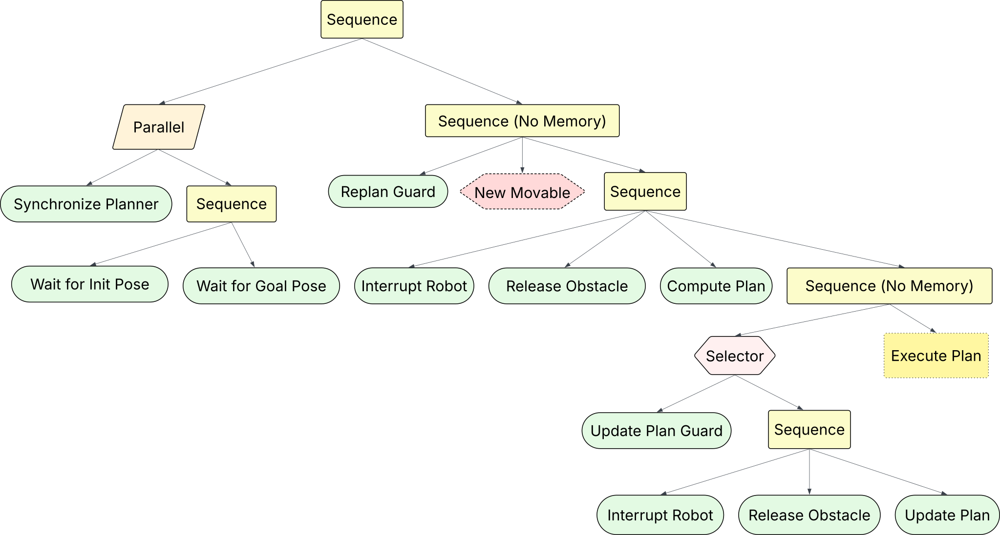

# NAMOROS

A set of ROS2 nodes which expose services and topics for computing NAMO plans and interacting with the **namosim** planner
This repo consists of the following ROS2 packages:

## System Requirements

- Ubuntu 22.04
- ROS2 Humble

## Setup

First, clone the repo.

```bash
git clone --recurse-submodules git@gitlab.inria.fr:chroma/namo/namoros.git
cd namoros
```

Next, use `rosdep` to install the dependencies listed in the `package.xml` files:

```bash
rosdep install --from-paths . -r -y
```

If any of the python dependencies fail to install with `rosdep` you can try to install them with `pip` instead:

```bash
pip install -r namosim/requirements.txt
pip install -r namoros/requirements.txt
```

Finally, build and source the project.

```bash
colcon build
source install/setup.bash
```

## Demostrations

In order to launch a simulation demonstration a robot that makes use of namoros nodes, run the following script.

```bash
./namoros/launch_demo.sh
```

## Architecture

### Main Behavior Tree

The simulated demo robot for namoros makes use of the following behavior tree. This tree ticks at a rate of 2Hz.



## Authors

- David Brown
- Jacques Saraydaryan
- Olivier Simonin
- Benoit Renault

## Affiliated Teams and Organisations

|                                    | Org/Team                                      |
| ---------------------------------- | --------------------------------------------- |
|     | [Inria](https://inria.fr/fr)                  |
|  | [INSA Lyon](https://www.insa-lyon.fr/)        |
|       | [CITI Laboratory](https://www.citi-lab.fr/)   |
| CHROMA                             | [CHROMA Team](https://www.inria.fr/en/chroma) |

## Cite Us

If you reuse any of the provided data/code, please cite the associated papers:

```bibtex
@inproceedings{renault:hal-04705395,
  TITLE = {{Multi-Robot Navigation among Movable Obstacles: Implicit Coordination to Deal with Conflicts and Deadlocks}},
  AUTHOR = {Renault, Benoit and Saraydaryan, Jacques and Brown, David and Simonin, Olivier},
  URL = {https://hal.science/hal-04705395},
  BOOKTITLE = {{IROS 2024 - IEEE/RSJ International Conference on Intelligent Robots and Systems}},
  ADDRESS = {Abu DHABI, United Arab Emirates},
  PUBLISHER = {{IEEE}},
  PAGES = {1-7},
  YEAR = {2024},
  MONTH = Oct,
  KEYWORDS = {Planning ; Scheduling and Coordination ; Path Planning for Multiple Mobile Robots or Agents ; Multi-Robot Systems},
  PDF = {https://hal.science/hal-04705395v1/file/IROS24_1134_FI.pdf},
  HAL_ID = {hal-04705395},
  HAL_VERSION = {v1},
}
```

```bibtex
@inproceedings{renault:hal-02912925,
  TITLE = {{Modeling a Social Placement Cost to Extend Navigation Among Movable Obstacles (NAMO) Algorithms}},
  AUTHOR = {Renault, Benoit and Saraydaryan, Jacques and Simonin, Olivier},
  URL = {https://hal.archives-ouvertes.fr/hal-02912925},
  BOOKTITLE = {{IROS 2020 - IEEE/RSJ International Conference on Intelligent Robots and Systems}},
  ADDRESS = {Las Vegas, United States},
  SERIES = {2020 IEEE/RSJ International Conference on Intelligent Robots and Systems (IROS) Conference Proceedings},
  PAGES = {11345-11351},
  YEAR = {2020},
  MONTH = Oct,
  DOI = {10.1109/IROS45743.2020.9340892},
  KEYWORDS = {Navigation Among Movable Obstacles (NAMO) ; Socially- Aware Navigation (SAN) ; Path planning ; Simulation},
  PDF = {https://hal.archives-ouvertes.fr/hal-02912925/file/IROS_2020_Camera_Ready.pdf},
  HAL_ID = {hal-02912925},
  HAL_VERSION = {v1},
}
```
