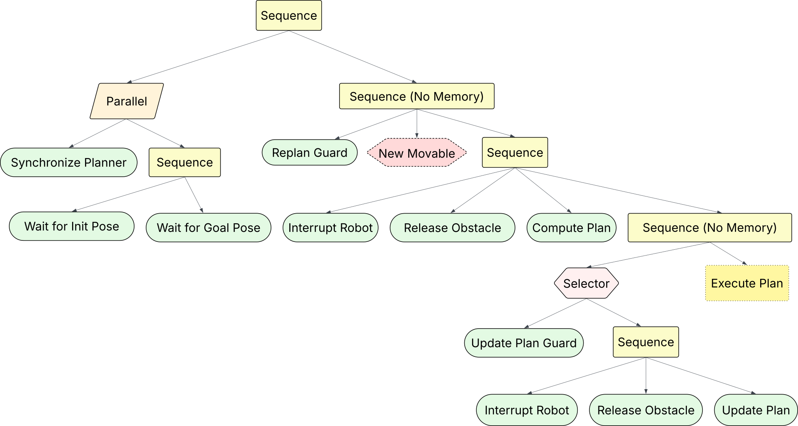

# Summary

NAMOROS is a ROS 2 package addressing the problem of **N**avigation **A**mong **M**ovable **O**bstacles (NAMO). It enables mobile robots to plan and execute navigation tasks in environments where certain obstacles can be grasped and relocated. NAMOROS encapsulates our NAMOSIM [@renault_phd_thesis; @renault_2024_iros; @renault_2020_iros] motion planner within a ROS 2 framework, providing services, actions, and message types to facilite the execution of NAMO plans on real and simulated robots. The key features allow users to compute and update NAMO plans, and dynamically synchronize the planner with the changing environment state. The package also supports multi-robot environments and provides the ability to dynamically manage conflicts via NAMOSIM's communication-free coordination strategy [@renault_2024_iros]. NAMOROS integrates seamlessly with [Gazebo Sim](https://gazebosim.org/home) or any ROS 2-compatible mobile robot platform such as Turtlebot. It supports holonomic and differential-drive motion models. NAMOROS is designed for research and development in multi-robot navigation, particularly in interactive environments.

# Statement of Need

Robotic navigation in dynamic and cluttered environments remains a critical challenge in mobile robotics. Many interesting applications involve some kind of physical interaction with the environment and social coordination with other agents. Traditional navigation methods typically assume static obstacles in non-interactive environments, leaving high-level behaviors to other parts of the software stack which complicates their implementation. Ideally, motion planners should be able to consider physical and social interactions in the environment. NAMOROS address this gap by providing open-source ROS 2 package for navigation planning in dynamic multi-agent environments with movable obstacles. Furthermore, many prior works on NAMO were conducted in simplified simulations, outside the ROS 2 ecosystem and were therefore poorly compatible with physical robotic platforms. NAMOROS addresses this issue by providing a ROS 2 package that supports reproducible research in and practical deployment of NAMO algorithms on real robotic systems.

In addition to single-robot navigation, NAMOROS provides important multi-robot conflict avoidance and deadlock resolution capabilities. It supports real-time synchronization of the planner state with the current state of the environment which allows for the detection of conflicts and deadlocks, and leverages the communication-free coordination strategy from NAMOSIM's `Stilman2005` agent to resolve them. This makes it particularly suitable for multi-robot settings where reactive and adaptive behavior is essential for robust operation.

# Software Description

NAMOROS consists of:

- ROS 2 nodes for computing and executing NAMO plans
- Integration with the NAMOSIM [@renault_phd_thesis; @renault_2020_iros; @renault_2024_iros] planner for simulation
- Support for holonomic and differential drive robots
- Extensible agent framework (e.g., Stilman2005 baseline agent)
- Tools for visualization (RViz), scenario creation, and benchmarking
- Example scripts and demonstration scenarios

## Key Features

NAMOROS provides the following key features:

- **Full ROS 2 Compatibility**: Includes modular ROS 2 nodes for NAMO planning and execution.
- **Multi-Robot Support**: Supports communication-free multi-robot coordination by dynamically detecting and reacting to conflicts.
- **Movable Obstacle Interaction**: Enables grasping, relocating, and releasing of obstacles during navigation.
- **Dynamic Replanning**: Continuously updates plans based on real-time sensor data and robot interactions.
- **Simulation Integration**: Seamlessly integrates with Gazebo Sim for physics-based validation.
- **Support for Multiple Locomotion Models**: Compatible with both holonomic and differential-drive robots.
- **Behavior Tree Architecture**: Modular, extensible control logic implemented with behavior trees.
- **Custom Planning Backend**: Interfaces with NAMOSIM a dedicated NAMO planner with multi-robot awareness.
- **Extensive Visualization Tools**: Includes support for RViz and custom visualization markers.
- **Scenario and Benchmarking Tools**: Offers utilities for reproducible experiments and comparative evaluation.
- **Custom Gazebo Plugins**: Includes plugins to simulate physical interactions like grabbing and releasing obstacles.

## Architecture

The system is organized as ROS 2 packages:

- `namoros`: ROS 2 nodes to control the robot and interacting with the namosim planner within a behavior tree framework
- NAMOSIM: The core planner for navigation and multi-robot coordination
- `namoros_msgs`: Custom ROS 2 message definitions
- `namoros_gz`: Custom Gazebo plugin for simulating grab and release actions.

Here is a block diagram showing the main components of NAMOROS:

{style="display: block; margin: 0 auto"}

The **NAMO Planner** block is a custom ROS 2 node that manages the namosim planner and exposes services and actions for interacting with it.

The **NAMO Behavior Tree** block is another custom node that executes the main behavior tree which controls the robot execution and interaction with the planner node.

The other blocks, `nav2` and `aruco_markers`, are third-party packages used for simple navigation and detection of visual markers placed on movable obstacles.

If running in a Gazebo simulation, a plugin from the `namoros_gz` package is provided to simulate grab and release actions. It works by dynamically creating a fixed joint between a user-chosen link on the robot and a link on the obstacle.

### Main Behavior Tree

NAMOROS provides a behavior tree to run NAMO plans on a real or simulated robot. This behavior tree controls the robot while managing sensor data and interactions with the planner node. The tree is illustrated in the following diagram and is configured to tick at a frequency of 2Hz. The robot starts by waiting to receive a start pose and a goal pose. These may come from the scenario file or be published to the corresponding ROS 2 topics.

The behavior tree continuously monitors the robot's sensor data to track the positions of other robots and movable obstacles. It uses this data during specific periods to synchronize the planner node's state with the estimated state of the environment, which is necessary for conflict detection. The _New Movable_ node encapsulates a subtree that handles dynamic detection of movable obstacles but is only used when that feature is activated and is not illustrated for brevity.

{style="display: block; margin: 0 auto"}

### Execute Plan Subtree

Because a NAMO plan consists of multiple behaviors such as path following, and grabbing and releasing obstacles, and because the plan is initially unknown and subject to change, the _Execute Plan_ behavior dynamically creates and executes a subtree corresponding to the current plan. The following diagram shows an example subtree which consists of a _transit_ path followed by a _transfer_ path to move an obstacle, and lastly another transit path to reach the goal. Immediately before and after each _transfer_ path there are also grab and release sequences. Each of these behaviors are themselves small subtrees. The _Execute Plan_ subtree always starts with a release behavior just in case the robot was already holding an obstacle at the time the plan was computed.

{style="display: block; margin: 0 auto"}

## Conflict Avoidance and Deadlock Resolution

Detecting and handling conflicts relies on implicit-coordination strategy implemented in NAMOSIM's `Stilman2005` agent. However, it depends on keeping the planner synchronized with the robot's current perceived state. During path following, the behavior tree periodically synchronizes the planner node with the current estimated state of the environment and checks for conflicts. When a conflict is detected, the robot is interrupted, the planner node is manually synchronized with the robot's current perceived state, the plan is updated, and finally plan execution is restarted. The deadlock resolution strategies likewise depend on the coordination algorithm from the `Stilman2005` agent in NAMOSIM.

# Acknowledgements

This research was supported by the Inria NAMOEX initiative. We express our gratitude to Benoit Renault, whose PhD thesis forms the foundation of this work.
