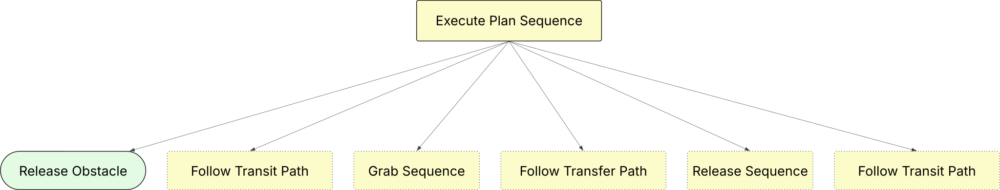
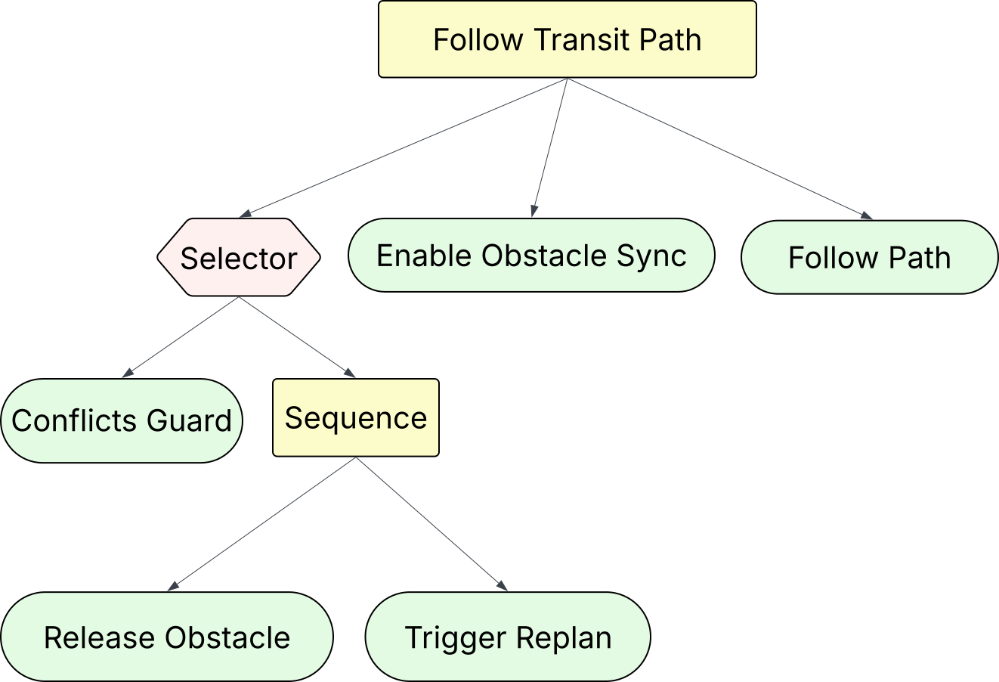
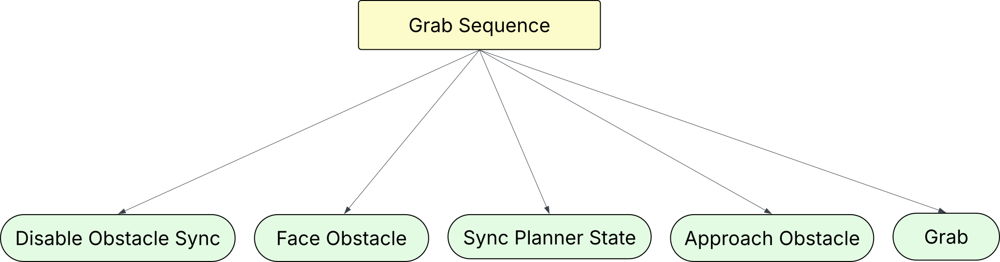

# Summary

NAMOROS is a set of ROS2 nodes and simulation tools for the problem of Navigation Among Movable Obstacles (NAMO). It enables mobile robots to plan and execute navigation tasks in environments where certain obstacles can be relocated. The project provides both simulation (via the `namosim` planner) and real-robot execution capabilities, supporting holonomic and differential drive robots. NAMOROS is designed for research and development in multi-robot navigation, path planning, and socially-aware navigation.

# Statement of Need

Robotic navigation in dynamic and cluttered environments is a fundamental challenge in robotics. Traditional navigation approaches assume static obstacles, but many real-world scenarios require robots to interact with and move obstacles to achieve their goals. NAMOROS addresses this gap by providing open-source tools for NAMO, supporting both simulation and real-world deployment, and enabling reproducible research in this area.

# Software Description

NAMOROS consists of:
- ROS2 nodes for computing and executing NAMO plans
- Integration with the `namosim` planner for simulation
- Support for holonomic and differential drive robots
- Extensible agent framework (e.g., Stilman2005 baseline agent)
- Tools for visualization (RViz), scenario creation, and benchmarking
- Example scripts and demonstration scenarios

## Architecture

The system is organized as ROS2 packages:
- `namoros`: ROS2 nodes for plan execution and robot integration
- `namosim`: Simulation and planning backend
- `namoros_msgs`: Custom ROS2 message definitions

The main behavior tree for the demo robot ticks at 2Hz and coordinates navigation, obstacle manipulation, and recovery behaviors.

### Main Behavior Tree


### Execute Plan Subtree



### Transit Path Sequence



### Grab Sequence



### Release Sequence

{width="500px"}

## Usage

### Simulation Demo

```bash
colcon build
source install/setup.bash
./namoros/launch_demo.sh
```

### Real Robot

Prepare the map image, YAML files, and NAMO configuration. See the demo script and documentation for details.

## Dependencies

- Ubuntu 22.04
- ROS2 Humble
- Python 3
- Key Python dependencies: numpy, typer, jinja2, transforms3d, pytest, keyboard, aabbtree, bidict, cairosvg, jsonpickle, matplotlib, numpy-stl, opencv-python-headless, pandas, pillow, pydantic, shapely, torch, torchvision, transformers, triangle, wandb
- ROS2 packages: geometry_msgs, grid_map, nav_msgs, navigation2, py_trees, rclpy, robot_state_publisher, rviz2, xacro, etc.

# Acknowledgements

This work is supported by Inria, INSA Lyon, CITI Laboratory, and the CHROMA Team. We thank all contributors and users of the project.

# References

If you reuse any of the provided data/code, please cite the associated papers:

```bibtex
@inproceedings{renault:hal-04705395,
  TITLE = {{Multi-Robot Navigation among Movable Obstacles: Implicit Coordination to Deal with Conflicts and Deadlocks}},
  AUTHOR = {Renault, Benoit and Saraydaryan, Jacques and Brown, David and Simonin, Olivier},
  URL = {https://hal.science/hal-04705395},
  BOOKTITLE = {{IROS 2024 - IEEE/RSJ International Conference on Intelligent Robots and Systems}},
  ADDRESS = {Abu DHABI, United Arab Emirates},
  PUBLISHER = {{IEEE}},
  PAGES = {1-7},
  YEAR = {2024},
  MONTH = Oct,
  KEYWORDS = {Planning ; Scheduling and Coordination ; Path Planning for Multiple Mobile Robots or Agents ; Multi-Robot Systems},
  PDF = {https://hal.science/hal-04705395v1/file/IROS24_1134_FI.pdf},
  HAL_ID = {hal-04705395},
  HAL_VERSION = {v1},
}
```

```bibtex
@inproceedings{renault:hal-02912925,
  TITLE = {{Modeling a Social Placement Cost to Extend Navigation Among Movable Obstacles (NAMO) Algorithms}},
  AUTHOR = {Renault, Benoit and Saraydaryan, Jacques and Simonin, Olivier},
  URL = {https://hal.archives-ouvertes.fr/hal-02912925},
  BOOKTITLE = {{IROS 2020 - IEEE/RSJ International Conference on Intelligent Robots and Systems}},
  ADDRESS = {Las Vegas, United States},
  SERIES = {2020 IEEE/RSJ International Conference on Intelligent Robots and Systems (IROS) Conference Proceedings},
  PAGES = {11345-11351},
  YEAR = {2020},
  MONTH = Oct,
  DOI = {10.1109/IROS45743.2020.9340892},
  KEYWORDS = {Navigation Among Movable Obstacles (NAMO) ; Socially- Aware Navigation (SAN) ; Path planning ; Simulation},
  PDF = {https://hal.archives-ouvertes.fr/hal-02912925/file/IROS_2020_Camera_Ready.pdf},
  HAL_ID = {hal-02912925},
  HAL_VERSION = {v1},
}
```

# License

This work is licensed under the MIT License. 